<h1 align="center">Moto Front</h1>

----

----
## Stack
JS, React, Redux, SCSS.
____
## Short description
This is a React/Redux-based abstract CRUD application featuring:
<li>Permissions management</li>
<li>Internationalization (i18n) and localization</li>
<li>Navigation</li>
<li>Theme configuration (light/dark mode with custom color tuning)</li>
<li>Full CRUD functionality with notifications</li>

____
## Authentication / permissions
A simple login and logout flow authenticates users and retrieves their authorities from the backend.
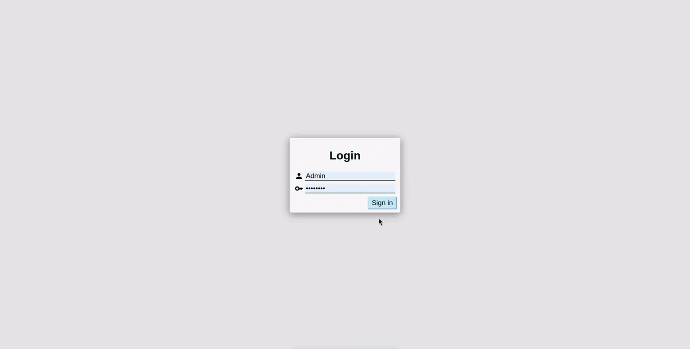

Permissions are evaluated against a static configuration in config.js before routing to any page.  
If access is denied, users are shown an explicit access restriction message.
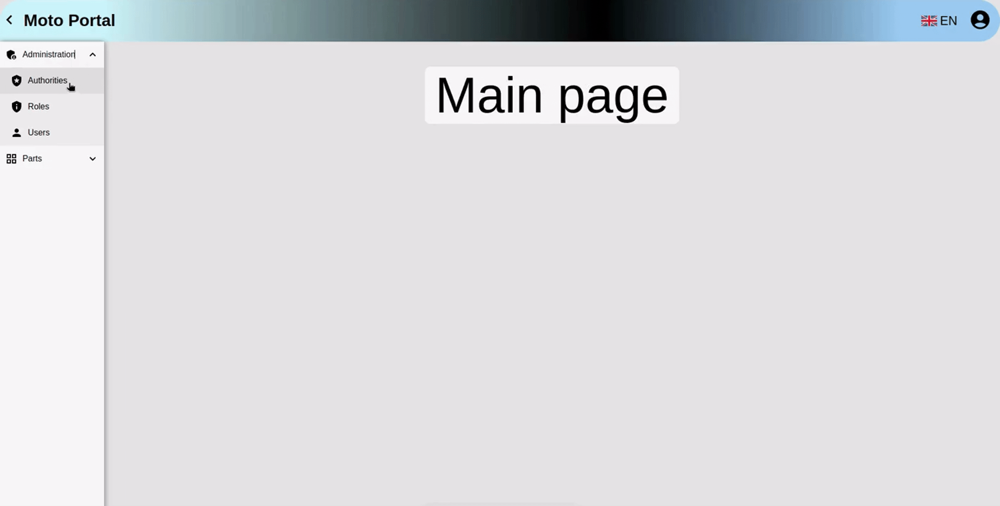

All permission states are persisted within the authSlice of the Redux store.
____
## Menu configuration
The main left-hand navigation menu is dynamically generated from a JSON structure defined in config.js, enabling flexible and maintainable route management without code changes.
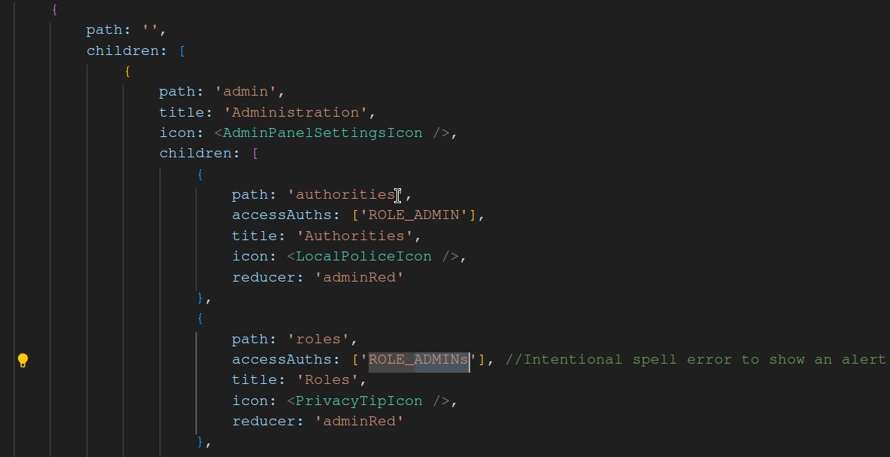
____
## Navigation
Users can navigate through the application via two primary menus:
<li>Main left-hand sidebar</li>
<li>Dropdown menu under the account icon in the top-right corner</li>

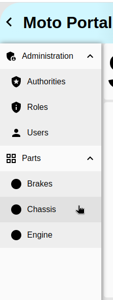
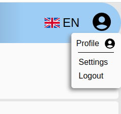
____
## Theme
Users can select between predefined light and dark theme variants.  
Additionally, individual colors can be adjusted in real time through an interactive theme editor.
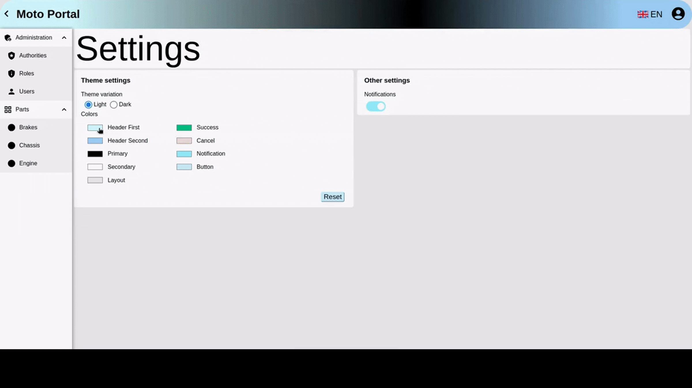
____
## Settings
The Settings page centralizes user preferences, including:
<li>Theme selection and customization</li>
<li>Notification toggle (enable/disable global UI notifications)</li>

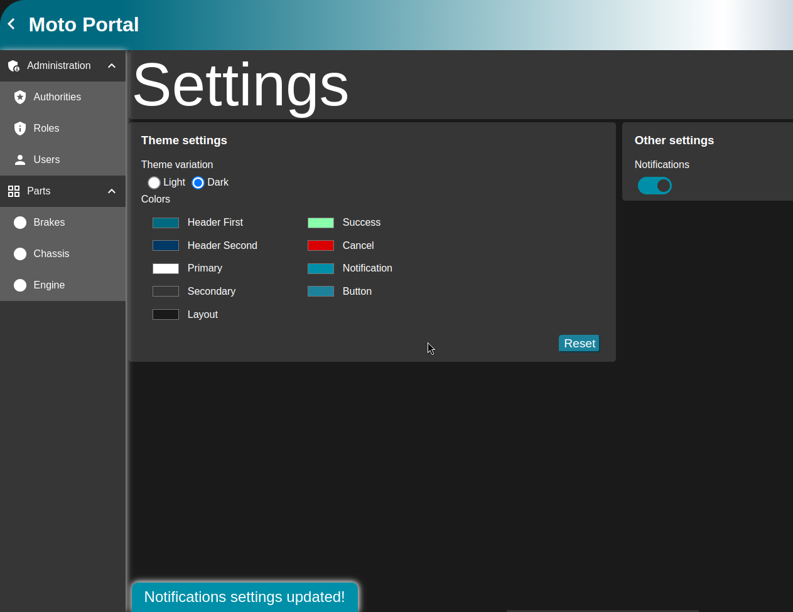

____
## Profile
User details and password management are the main components of this page.
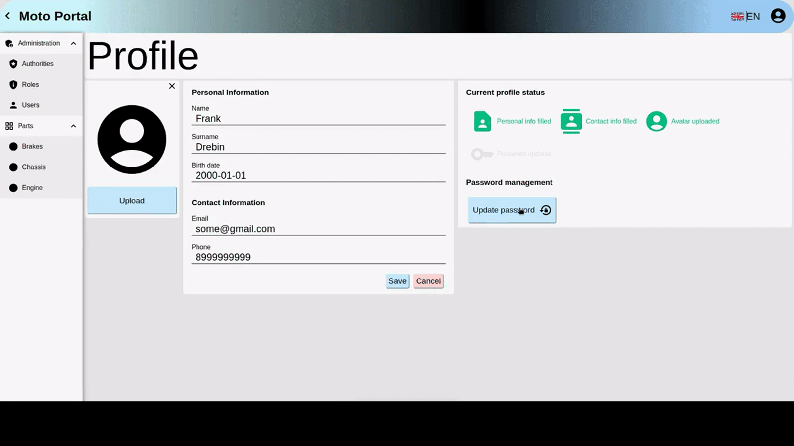
____
## CRUD page
Sortabe table is a central part on this page, with pagination component at the bottom.
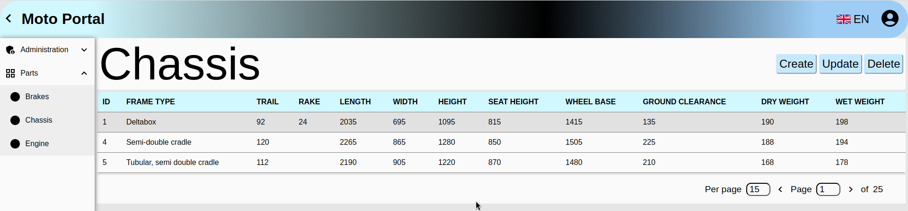

Each operation triggers a notification(if notifications are enabled on the settings page) at a left bottom corner(if left menu is closed).
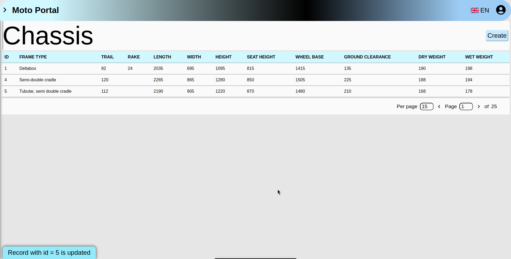

The update modal provides a clean, form-based interface for editing existing records.
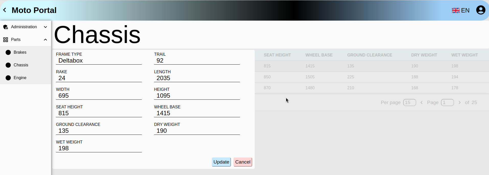
____
## Localization
The application supports English and Spanish locales via i18next (i18n), enabling seamless language switching.
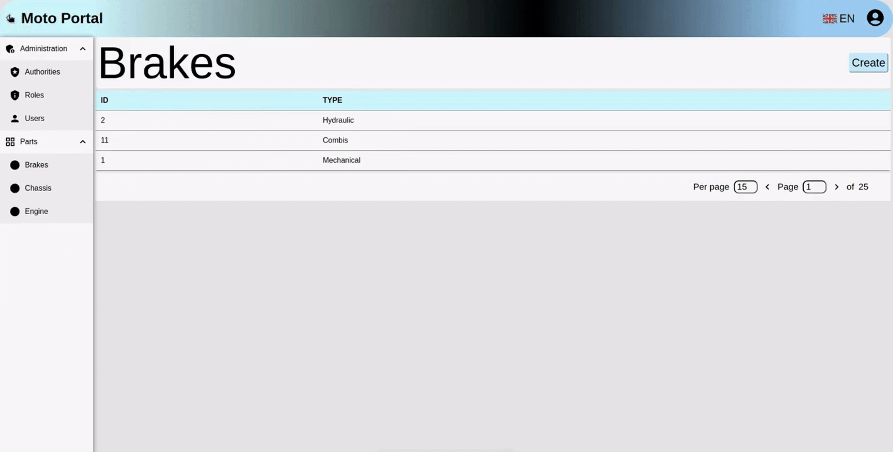
____
## Storage
State management is handled entirely via Redux, with data organized into dedicated store and slice files.  
This ensures predictable state transitions, easy debugging, and scalable state architecture.
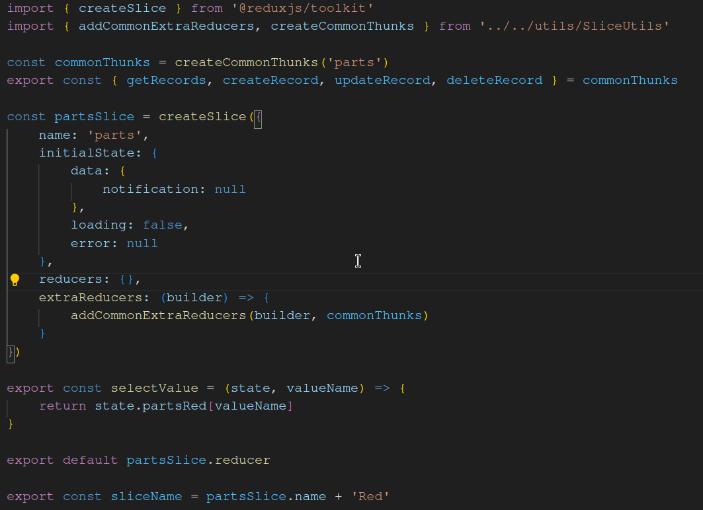
____
## Test
The project includes a comprehensive test suite covering:
<li>Unit</li>
<li>Integration</li>
<li>Snapshot</li>
<li>Interaction and other tests</li>

____
## CI/CD
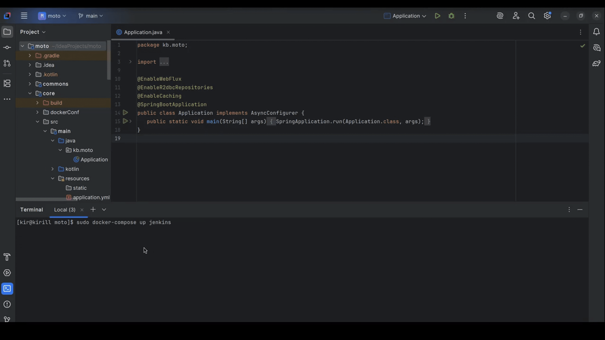

Jenkins orchestrates a parallelized CI/CD pipeline to automate builds, tests, and deployments.
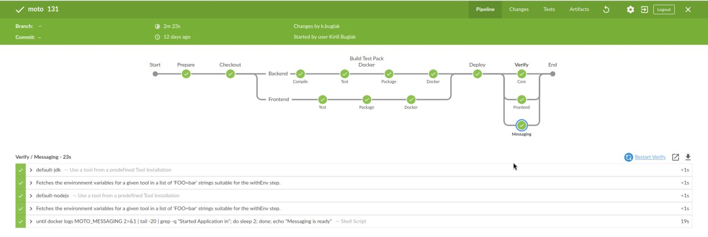
____
## How to build
Just run "pnpm install" in your terminal.
And if you want to run the app locally - "pnpm start", otherwise(Docker container) - use CI/CD tool.
____